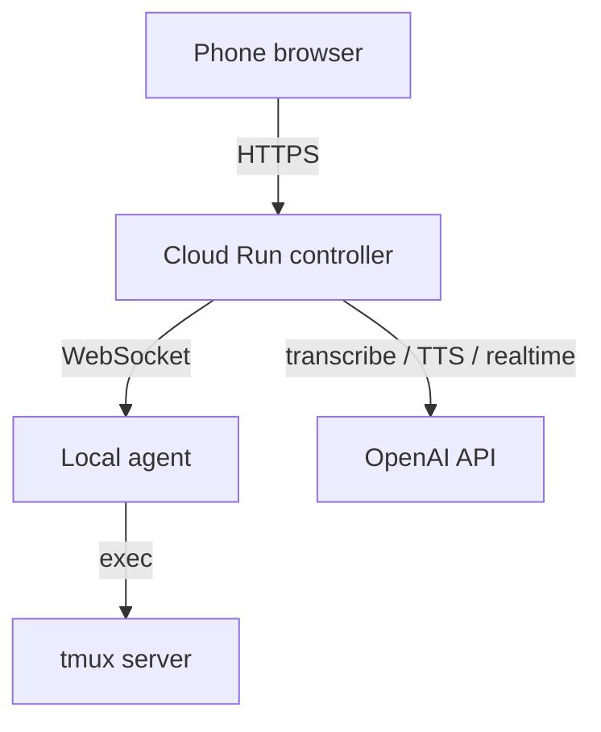
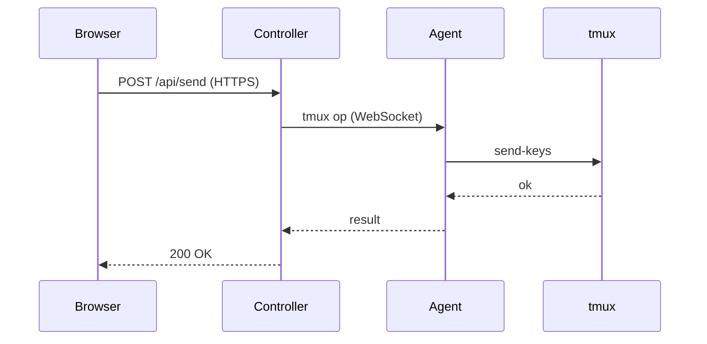
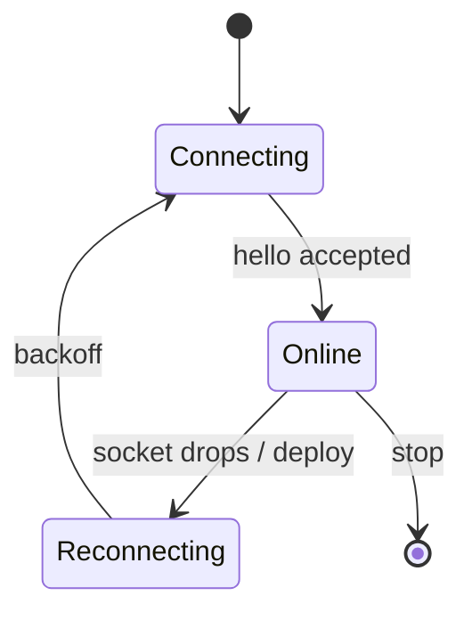

# tmux-mobile architecture

A phone-friendly web UI for driving **tmux** on a remote machine. `server.mjs`
runs in three roles: a **controller** (public Cloud Run service that serves the
UI), an **agent** (runs next to tmux on your machine), and a **local** all-in-one
mode. The agent dials *out* to the controller over a WebSocket, so the machine
needs no inbound port.

## Request flow

The browser only ever talks to the controller. The controller brokers every
tmux command to the right machine over the agent's outbound WebSocket.

## How a pane command travels

## Connection lifecycle

The agent keeps the link healthy with ping/pong liveness and re-dials onto a new
controller revision when it detects one (via `/api/health`), so a deploy never
leaves it pinned to old code.

## Smart content viewer

Paths to images and markdown files in the pane are clickable. The controller
reads the file **through the agent** (confined to the pane's working directory),
then the browser renders it inline — including the Mermaid diagrams on this page.
